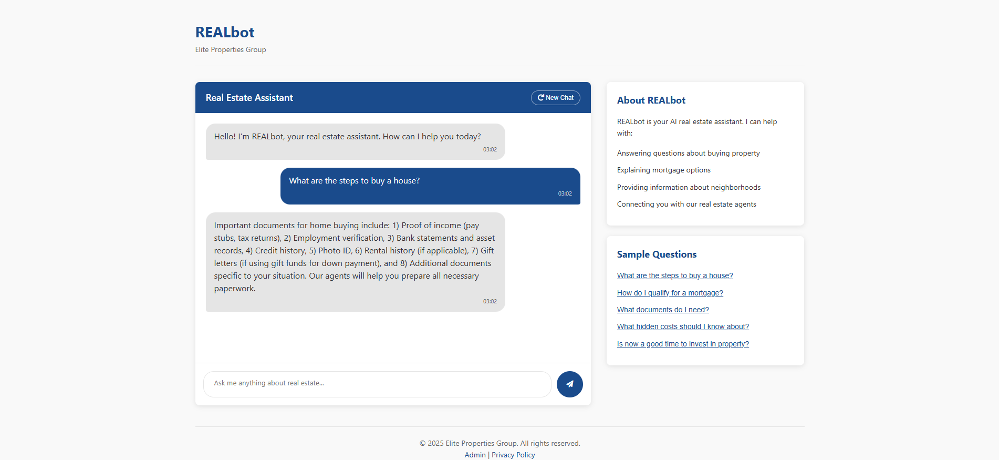

# REALbot - AI-Powered Real Estate Assistant
<div align="center">
  


</div>
REALbot is an intelligent conversational assistant designed for Elite Properties Group to streamline client interactions, automate lead qualification, and provide 24/7 support for potential property buyers.



## 🏠 Overview

REALbot transforms the real estate customer experience by providing instant, accurate responses to property inquiries while intelligently qualifying leads before connecting them with human agents. The system combines cutting-edge AI technology with a carefully curated knowledge base of real estate expertise.

### Key Features

- **Natural language conversations** about properties, neighborhoods, pricing, and financing
- **Smart lead qualification** through conversational data collection (budget, timeline, preferences)
- **Seamless handoff** to human agents when clients are ready to view properties
- **Administrative dashboard** for analytics and knowledge base management
- **Corporate branding** with customized interface using company colors and styling

## 💻 Technical Architecture

REALbot is built with a modern, scalable architecture:

```
REALbot/
├── frontend/                 # React.js frontend application
│   ├── public/               # Static assets
│   ├── src/                  # Source files
│   │   ├── components/       # UI components
│   │   ├── pages/            # Page layouts
│   │   ├── services/         # API communication
│   │   └── styles/           # CSS/SCSS files
│   └── package.json          # Dependencies
│
├── backend/                  # Node.js/Express server
│   ├── controllers/          # Request handlers
│   ├── models/               # Data models
│   ├── routes/               # API endpoints
│   ├── services/             # Business logic
│   ├── utils/                # Helper functions
│   └── server.js             # Main entry point
│
├── knowledge-base/           # Real estate domain knowledge
│   ├── questions/            # Common questions and answers
│   ├── templates/            # Response templates
│   └── entities/             # Property and location data
│
└── config/                   # Configuration files
    ├── ai-prompts/           # System prompts for AI model
    └── deployment/           # Deployment configurations
```

### Technology Stack

- **Frontend**: React.js, Material UI, Chart.js
- **Backend**: Node.js, Express
- **AI Engine**: Large Language Model via OpenAI API
- **Database**: MongoDB for conversation history and analytics
- **Deployment**: Docker containers, ready for cloud deployment

## 🔍 AI Capabilities

REALbot leverages advanced AI to:

- Understand complex property requirements
- Maintain context throughout multi-turn conversations
- Extract key information (budget range, preferred locations, timeline)
- Adapt responses to different customer knowledge levels
- Detect when a lead is qualified and ready to speak with an agent

## 📊 Analytics & Reporting

The admin dashboard provides valuable insights:

- Most frequent customer questions
- Conversion rates from chat to qualified lead
- Peak interaction times
- Average conversation length
- Knowledge gaps identified from unanswered questions

## 🚀 Business Impact

REALbot delivers measurable value to real estate operations:

- **Reduce response time** from hours to seconds
- **Free up agent time** by automating routine inquiries
- **Capture leads 24/7** even outside business hours
- **Improve lead quality** through consistent qualification
- **Gather market intelligence** from conversation patterns

## 💼 Implementation Process

Deploying REALbot for a new client involves:

1. Knowledge base customization with client-specific information
2. UI branding to match corporate identity
3. System prompt fine-tuning for the right tone and expertise level
4. Integration with existing website and CRM systems
5. Testing with sample customer scenarios
6. Agent training and dashboard orientation

## 🛠️ Customization Options

REALbot can be extended with:

- Integration with property listing databases
- Support for additional communication channels (WhatsApp, SMS)
- Multi-language support for international clients
- Advanced analytics and business intelligence features
- Automated follow-up sequences for leads

## 📱 Demo Access

A live demo of REALbot is available at: [demo.realbot.ai](https://demo.realbot.ai)

**Demo Credentials:**
- Username: `demo@eliteproperties.com`
- Password: `REALbotDemo2025`

## 📞 Support and Documentation

For technical support and further documentation:

- Email: support@realbot.ai
- Technical Documentation: [docs.realbot.ai](https://docs.realbot.ai)
- API Reference: [api.realbot.ai](https://api.realbot.ai)

---

© 2025 REALbot AI Solutions | All Rights Reserved
